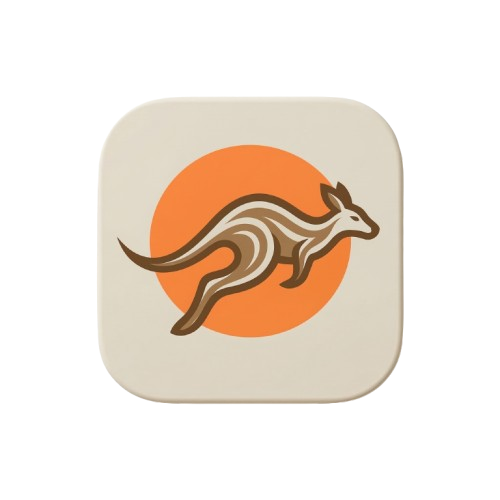
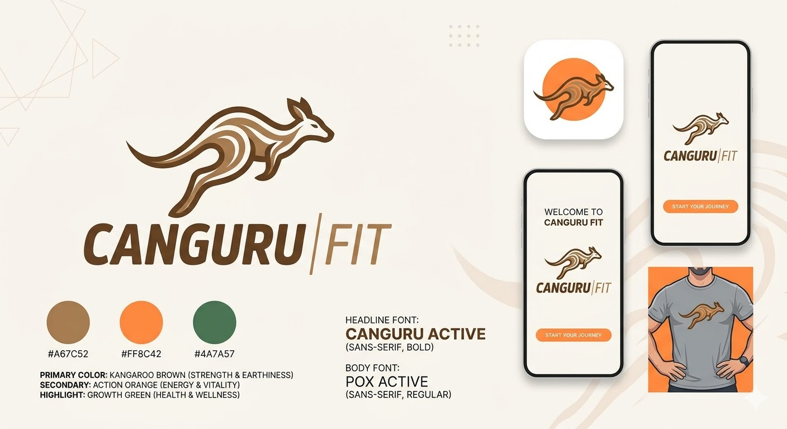
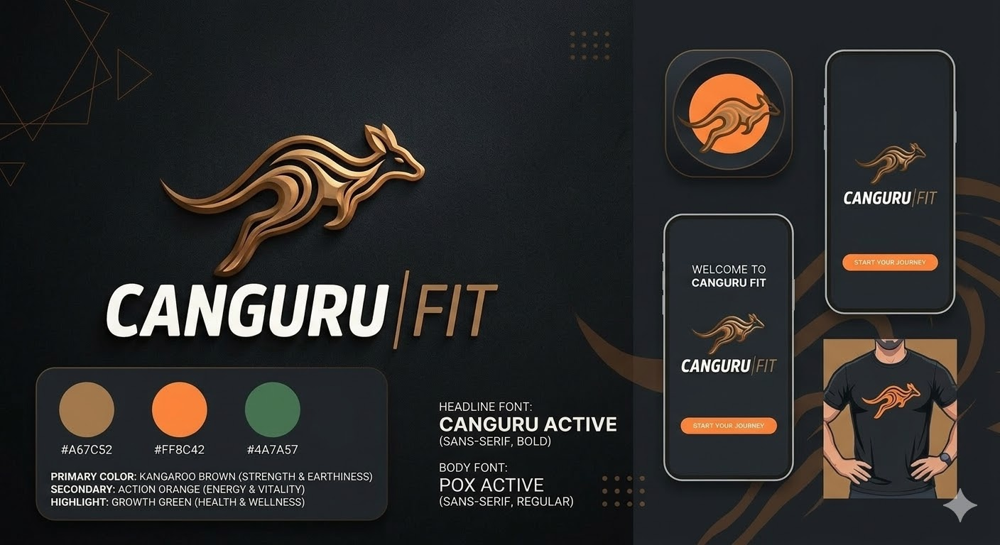

  

# 🦘 Canguru Fit - Brand Guidelines & UI Specs

  
  
  
  
  

Bem-vindo à documentação oficial de identidade visual do aplicativo **Canguru Fit**. Este guia define os padrões de uso para logotipos, cores, tipografia e elementos visuais para garantir consistência em todas as plataformas.

---

## 1. O Conceito da Marca

O **Canguru Fit** une a agilidade, força e impulsão do canguru ao dinamismo do universo fitness. Nosso design é minimalista, focado em movimento e performance, criado para motivar usuários em suas jornadas de treino acompanhados por um personal trainer.

---

## 2. Logotipo

O logotipo é composto por um ícone de canguru em salto estilizado com lines contínuas e uma tipografia robusta.

### Variações Oficiais

  
  

- **Primária (Light Mode):** Ícone Marrom Metálico e texto Marrom escuro em fundo claro.
- **Secundária (Dark Mode):** Ícone Marrom Metálico/Bronze e texto Branco em fundo escuro.
- **Monocromática (Preto):** Ícone e texto em preto sólido (`#000000`) para impressões simples ou fundos de alto contraste claros.
- **Monocromática (Branco):** Ícone e texto em branco sólido (`#FFFFFF`) para fundos fotográficos ou de alto contraste escuros.

### Regras de Uso (Do's e Don'ts)

- ✅ **Mantenha a proporção:** Nunca achate ou estique o logotipo.
- ✅ **Área de respiro:** Mantenha uma margem mínima equivalente a 50% do tamanho do ícone ao redor de toda a assinatura.
- ❌ **Não rotacione:** Mantenha o logotipo alinhado horizontalmente.
- ❌ **Não altere as cores:** Use apenas os códigos HEX oficiais detalhados abaixo.

---

## 3. Paleta de Cores (Color Palette)

A paleta foi inspirada no outback australiano e na psicologia do esporte.

### Cores Primárias

| Cor | Nome               | HEX       | RGB             | CMYK             | Uso Principal                              |
| :-- | :----------------- | :-------- | :-------------- | :--------------- | :----------------------------------------- |
| 🟤  | **Marrom Canguru** | `#A67C52` | `166, 124, 82`  | `25, 45, 70, 15` | Marca principal, ícone, botões secundários |
| ⚫  | **Dark Mode BG**   | `#1A1C1E` | `26, 28, 30`    | `70, 60, 55, 75` | Fundo principal do modo escuro             |
| ⚪  | **Light Mode BG**  | `#F7F5F0` | `247, 245, 240` | `2, 3, 5, 0`     | Fundo principal do modo claro              |

### Cores de Destaque e Ação

| Cor | Nome                  | HEX       | RGB            | CMYK             | Uso Principal                           |
| :-- | :-------------------- | :-------- | :------------- | :--------------- | :-------------------------------------- |
| 🟠  | **Laranja Ação**      | `#FF8C42` | `255, 140, 66` | `0, 55, 80, 0`   | CTAs, Botões primários, alertas, badges |
| 🟢  | **Verde Crescimento** | `#4A7A57` | `74, 122, 87`  | `70, 30, 75, 15` | Indicadores de sucesso, metas batidas   |

---

## 4. Tipografia (Typography)

Para manter a legibilidade em telas de todos os tamanhos e transmitir força, usamos fontes sem serifa (Sans-Serif).

### Fonte Primária (Títulos e Headings)

- **Família:** `Montserrat` ou `Roboto Condensed` _(sugestão caso não tenha uma fonte proprietária)_
- **Peso:** Bold (700) ou Extra-Bold (800)
- **Uso:** Logotipo, H1, H2, CTAs principais.

### Fonte Secundária (Corpo de Texto e UI)

- **Família:** `Inter` ou `Open Sans` _(sugestão)_
- **Peso:** Regular (400) e Medium (500)
- **Uso:** Parágrafos, legendas, descrições de treinos, inputs de formulário.

---

## 5. Ícones do Aplicativo (App Icons)

Ao exportar o ícone para as lojas de aplicativos (App Store / Google Play), siga as seguintes variações:

  
  
  

1. **Fundo Dark:** Fundo `#1A1C1E` com ícone Laranja Ação ou Branco.
2. **Fundo Light:** Fundo `#F7F5F0` com ícone Marrom Metálico ou Preto.
3. **Fundo Ação:** Fundo Laranja Ação (`#FF8C42`) com ícone Branco (Ideal para destaque máximo).

---

## 6. Guia Visual

### 6.1 White Mode

  

### 6.2 Dark Mode

  

_Documentação gerada para a equipe de UI/UX e Desenvolvimento do Canguru Fit._
